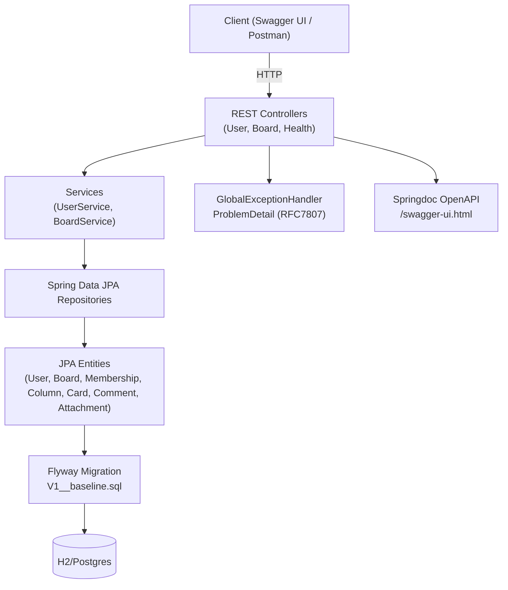

## Teaching Script — Week 1 Skeleton & Domain

### Goal for this slice
Boot a runnable Spring Boot app with the core domain modeled, database schema managed via Flyway, validation wired, consistent error responses, and an OpenAPI stub to anchor later sprints.

### Architecture snapshot
- `pom.xml`: Spring Boot 3.2, Web, Validation, JPA, Flyway, Actuator, Springdoc, H2, Lombok. Maven compiler targets Java 21 with Lombok annotation processing.
- Package layout:
  - `com.example.kanban` — entrypoint.
  - `domain` — JPA entities + enum.
  - `repository` — Spring Data interfaces.
  - `service` — thin services for User and Board.
  - `web` — controllers and DTOs.
  - `web.error` — global error handling.
  - `config` — OpenAPI metadata.

### Domain model highlights
- `User`, `Board`, `Membership`, `MembershipRole`, `BoardColumn`, `Card`, `CardComment`, `Attachment` all extend `BaseEntity` for `id`, `createdAt`, `updatedAt`.
- Ordering uses `position` (BigDecimal) on `BoardColumn` and `Card` to support gap-based inserts later.
- `Card` uses `@Version` for optimistic locking scaffolding.
- Relationships are `LAZY` to keep future queries predictable.

### Persistence & migrations
- Flyway baseline at `src/main/resources/db/migration/V1__baseline.sql` mirrors the entities and adds helpful indexes for ordering and lookups.
- JPA `ddl-auto=validate` ensures entity/table drift is caught on startup.
- Default datasource is H2 (PostgreSQL mode) stored at `./data/kanban-db`; swap to Postgres later by adjusting `application.yml`.

### REST surface (stub)
- `UserController` (`/api/v1/users`): create + fetch user with validation.
- `BoardController` (`/api/v1/boards`): create + fetch board; owner must exist.
- `InfoController` (`/api/health`): simple liveness without touching the DB.
- DTOs are records with Bean Validation annotations.

### Validation & error model
- `GlobalExceptionHandler` returns RFC7807 `ProblemDetail` objects.
  - Field errors aggregate into an `errors` map.
  - Constraint violations and not-found are explicitly handled.
  - Fallback handler provides a safe message and a hint.

### OpenAPI
- `OpenApiConfig` sets base metadata; Springdoc starter exposes `/v3/api-docs` and `/swagger-ui.html`.
- Controllers carry `@Operation` and `@Tag` to keep the generated spec readable.

### How to demo in class
1) Run `mvn clean spring-boot:run`.
2) Create a user then a board referencing that user; show validation by omitting fields.
3) Open Swagger UI to illustrate the auto-generated contract.
4) Inspect H2 file with any H2 console or by running `select * from users` to show Flyway-created schema.

### Teaching callouts
- Why `ddl-auto=validate`: forces disciplined migrations.
- Why `position` is decimal: enables mid-list inserts with fewer rewrites.
- Why `@Version` now: sets the stage for concurrency conflict demos later.
- Why Problem Details: consistent, client-friendly error payloads.

### Next sprint hooks (not implemented yet, but referenced)
- Realtime layer will attach to board events.
- Security and RBAC will build on `User` and `Membership`.
- File storage will use `Attachment.storagePath`.
